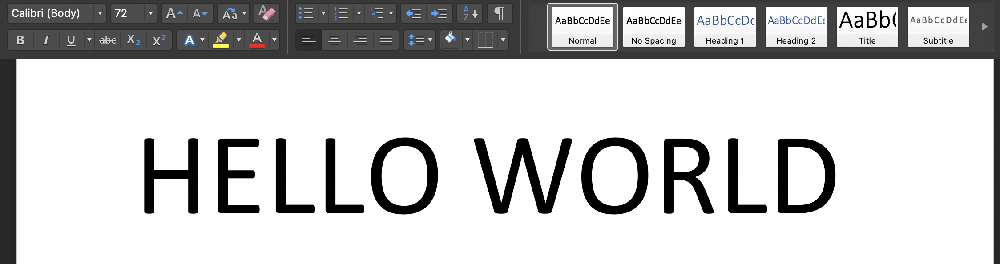
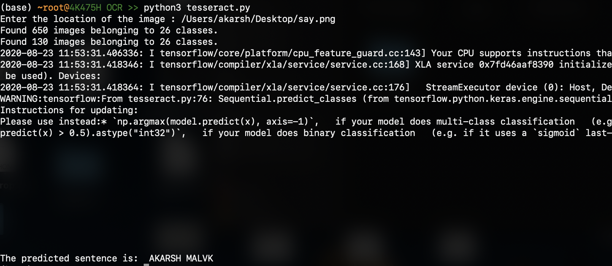
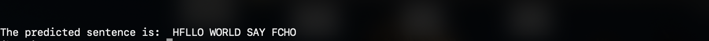

# Tesseract_model

## Introduction

Tesseract is an optical character recognition engine for various operating systems which extracts texts from an image and converts them to plain text.

This model is a very primitive form of the original google tesseract which extracts texts (ONLY CAPITAL LETTERS) from an image and converts them to plain text.

## Modules/Library REQUIREMENTS:

  1) os
  2) numpy
  3) PIL
  4) sys
  5) keras
  6) cropyble
  7) cv2
  8) shutil
  
## How To Run the script:

NOTE1:- The trained model is not provided. So for the very first time run the script as it is. Once the model is trained:
                                          COMMENT OUT 'Train_Model' on line '65' and then run the script for further use.
                                          
NOTE2:- Only some fonts were taken into account so remember to use default font (calibri) in image texts with a FONT SIZE of '72' as there are assumptions to extract letters.

Run the script on your terminal: 'python3 ocr_main.py':
input image is:

output is (the predicted result is at the bottom):

The input image can be of any number of words example:

output is:

